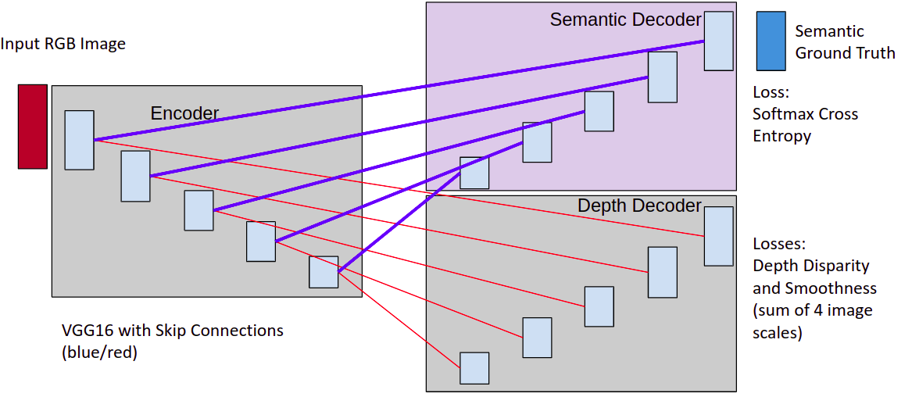
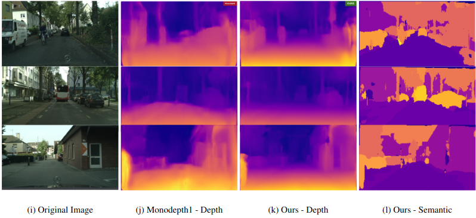

# Improved Monocular Depth Estimation using Semantic Information

The core contribution of this work comes from combining monocular depth estimation and semantic segmentation into one multi-task network to improve depth estimation accuracy. We extended the existing Monodepth network by adding a second decoder that is dedicated to the semantic segmentation task. The dual-decoder, multi-task network is trained with a hybrid loss function that combines the original depth-disparity losses from the depth decoder with the softmax cross-entropy loss of the semantic decoder. We also conduct experiments with an additional Dice loss added to the semantic decoder loss, with additional improvements shown.

<p align="center">
  
</p>

<p align="center">
  
</p>

## Pretained Monodepth with semantic decoder

* Download the preatined weigths from [here](https://drive.google.com/file/d/1c9wwCP2MtJwdEyeBEmNiLSoicdlr_9XE/view?usp=sharing)

## Pretained Monodepth1

* You can download our pre-trained models to an existing directory by running:  
```shell
sh ./utils/get_model.sh model_name output_directory
```

## Requirements
* Tensorflow 1.0
* python 
* CUDA 8.0

## Data
### [Cityscapes](https://www.cityscapes-dataset.com
Cityscapes \cite{Cityscapes} is a large-scale database that focuses on semantic understanding of urban street scenes. It provides semantic, instance-wise, and dense pixel annotations for 30 classes grouped into 8 different categories such as flat surfaces, humans, vehicles, constructions, objects, nature, sky, and void. The dataset consists of around 5000 fine annotated images and 20,000 coarse annotated ones captured in 50 cities during several months, daytimes, and good weather conditions. Originally,  it was recorded as video so the frames given in the dataset were manually selected to have the following features: a large number of dynamic objects, varying scene layout, and varying background.

You will need to register in order to download the data, which already has a refined train/val/test set with 5000 images. We used 3750 images for training.
We used `leftImg8bit_trainvaltest.zip`, `rightImg8bit_trainvaltest.zip` with the refined labels for training. 

## Test on single image

There is a simple mode monodepth_simple.py which allows you to quickly run our model on a test image. Download the pretrained weights from above and place them in the models folder.

```
python monodepth_simple.py --image_path ~/my_image.jpg --checkpoint_path ~/models/model_cityscapes
```
## Training 

**Warning:** The input sizes need to be mutiples of 128 for `vgg` or 64 for `resnet50` . 

The model's dataloader expects a data folder path as well as a list of filenames (relative to the root data folder):  
```shell
python3 monodepth_main.py --mode train --data_path /datasets/cityscapes/ --filenames_file  \
utils/cityscapes_fine_train.txt --input_height 256 --input_width 512 --batch_size 4 --log_dir \
~/tmp/ --checkpoint_path models/model_cityscapes
```

You can also fine-tune from a checkpoint using `--retrain`.  
You can monitor the learning process using `tensorboard` and pointing it to your chosen `log_directory`.  
By default the model only saves a reduced summary to save disk space, you can disable this using `--full_summary`.  
Please look at the [main file](monodepth_main.py) for all the available options.

## Testing  
To test change the `--mode` flag to `test`, the network will output the disparities in the model folder or in any other folder you specify with `--output_directory`.  
You will also need to load the checkpoint you want to test on, this can be done with `--checkpoint_path`:  
```shell
python monodepth_main.py --mode test --data_path ~/data/cityscapes/test/ \
--filenames_file ~/code/monodepth/utils/filenames/kitti_stereo_2015_test_files.txt --log_directory ~/tmp/ \
--checkpoint_path ~/tmp/my_model/model-181250
```

**Please note that there is NO extension after the checkpoint name**  
If your test filenames contain two files per line the model will ignore the second one, unless you use the `--do_stereo` flag.
The network will output two files `disparities.npy` and `disparities_pp.npy`, respecively for raw and post-processed disparities.

## Semantic Encoder
Please find the trained model for UNet [here](https://drive.google.com/file/d/1NX7P4lKDTfLq5V8J-g7gbetB7pgvDWbJ/view?usp=sharing)

## References
* http://visual.cs.ucl.ac.uk/pubs/monoDepth/
* https://arxiv.org/abs/1609.03677
